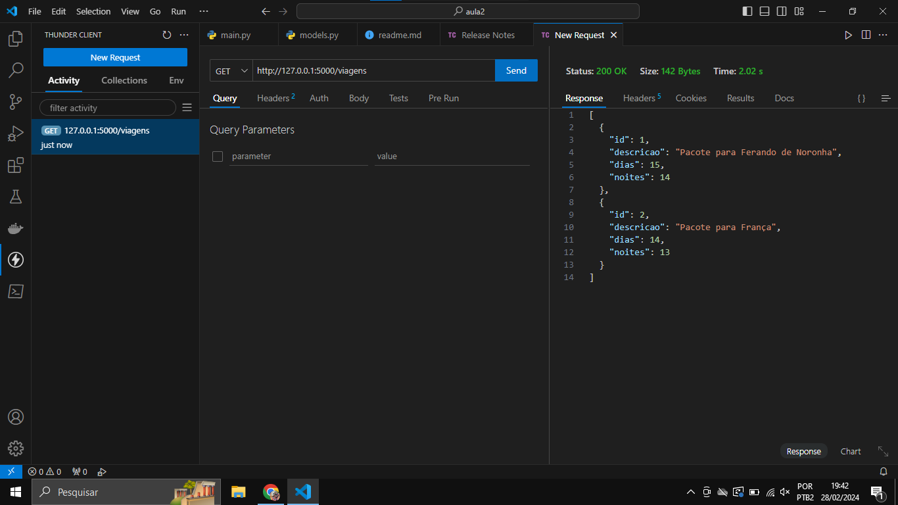

# API-Microsserviços
Projeto realizado em sala de aula.

 Print da execução do Swagger no FastAPI

 Print da execução do metodo get no ThunderClient

 instalar extensões
 	thunderclient
 	python
 	material icons
 rodar cmd
 	python -m venv env
 	env\Scripts\activate
 rodar pip install fastapi uvicorn
 pip freeze && pip freeze > requirements.tbr
 uvicorn main:app --host 127.0.0.1 --port 5000
